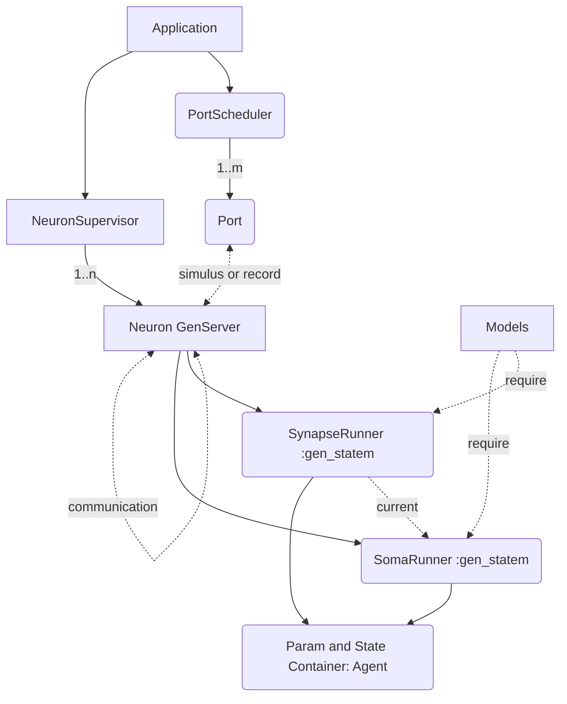

# [WIP] Glowworm

Simple PoC of neural simulation model.

> **warning**
>
> This is just a model to verify feasibility and may be deprecated at any time.

[简体中文](/README.zh-Hans.md)

The original idea from [spikingnn](https://web.archive.org/web/20190715023747/http://www.spikingnn.net/English/index.html). This is an elixir implementation with asynchoronous format.

Recording of idea: [Interactive testbed for cortical modeling? - Elixir Framework Forums / Nx Forum - Elixir Programming Language Forum](https://elixirforum.com/t/interactive-testbed-for-cortical-modeling/61178/3)

Simulation of neuron references amiryt's [Erlang-project](https://github.com/amiryt/Erlang-project), and hierarchical architecture inspired by [ThousandIsland](https://github.com/mtrudel/thousand_island).

Architecture of application like following graph:



## Installation

```elixir
def deps do
  [
    {:glowworm, git: "https://github.com/GES233/Glowworm.git"}
  ]
end
```

