# 【施工中】萤火虫🪲

一个相当业余相当民科的神经仿真的概念验证模型 ~（其实我也不知道该怎么定义）~，**可能随时放弃推进**。

[English](/README.md)

## 想法

记录着想法来源的内容 [Interactive testbed for cortical modeling? - Elixir Framework Forums / Nx Forum - Elixir Programming Language Forum](https://elixirforum.com/t/interactive-testbed-for-cortical-modeling/61178/3) 。

> 内容如下：
>
> 我曾经考虑过类似的想法，但我的想法仍然很幼稚，而且离实现还很远。
>
> 如果我没记错的话，皮质柱是一组神经元，从单个柱中记录可以使许多层的神经元产生极其复杂的行为。因此，我认为最好将建模水平设置得更具体，比如一个细胞，甚至是细胞膜的部分（细胞体、轴突、树突和突触），这是我原始想法中的观点。
>
> 像计算下一个时刻的膜电位或离子浓度这样的 CPU 密集型任务可以交给 Julia 或 Rust。与向相关节点发送脉冲相关的任务，或者如果神经元处于动作电位状态则可以由 BEAM 很好地处理。
>
> 给我这个想法的原始触发并不是类似于 Elixir 中的 Nx 这样的计算项目，而是来自生物学视角的以下三个事实：
>
> 1. 只有少数神经元处于激活状态
> 2. 单体以网格结构连接（我高中时并不理解编程中的“图”概念）
> 3. 单体形态的多样性（不同类型的神经元具有不同类型的神经递质或离子通道）
>
> 从这个角度来看，我认为更好的做法是建立一个通用的模拟或仿真平台，下一步是设置一个级别并深入研究。
>
> 最后，我不是以英语为母语的人，请纠正我如果有任何事实或语法错误。

同时也参考了 [amiryt/Erlang-project](https://github.com/amiryt/Erlang-project) 项目。

分层架构的设计理念来自于 Elixir 的 HTTP 服务器 [ThousandIsland](https://github.com/mtrudel/thousand_island) 。

其中本仓库项目的最终目标是采用更加复杂的神经元实现 [spikingnn](http://spikingnn.net) 。
其中原网站因为未知原因无法访问，可以通过 [WebArchive](https://web.archive.org/web/20190717080930/http://spikingnn.net/) 下载相关资料。

## 项目的设计

### 架构

项目架构如下图展示：

```mermaid
graph TD
  Application["应用（Application）"] --> NeuronSupervisor["神经元监视器（NeuronSupervisor）"]
  NeuronSupervisor --1..n--> Neuron["神经元（Neuron） GenServer"]
  Application --> PortScheduler("端口管理器（PortScheduler）")
  PortScheduler --1..m--> Port("端口（Port）")
  Port <-.刺激或记录.-> Neuron
  Neuron <-.神经元之间的通信.-> Neuron
  Neuron --> SomaRunner("神经元状态的仿真（SomaRunner） :gen_statem")
  Neuron --> SynapseRunner("突触的仿真（SynapseRunner） :gen_statem")
  SynapseRunner -.输入电流.-> SomaRunner
  Models["模型（通常用 NIF 实现）"] -.require.-> SomaRunner
  Models["模型（通常用 NIF 实现）"] -.require.-> SynapseRunner
```

### 神经网络的架构

TODO: until project finished.
