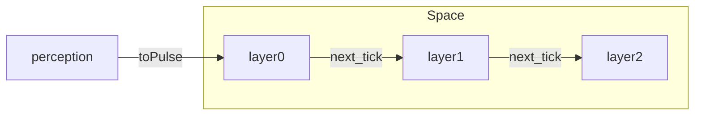
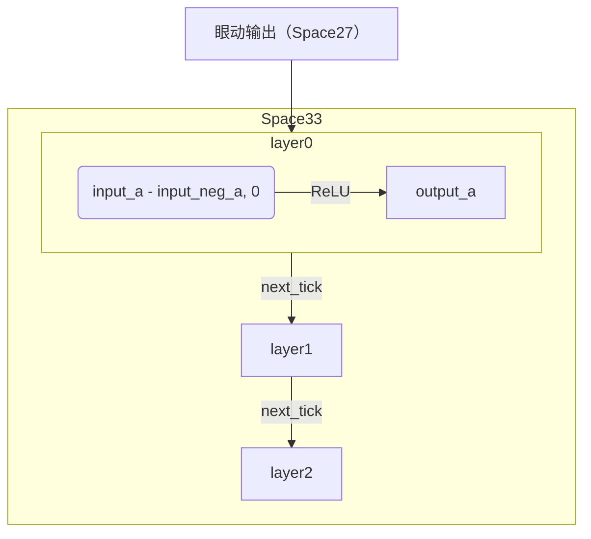
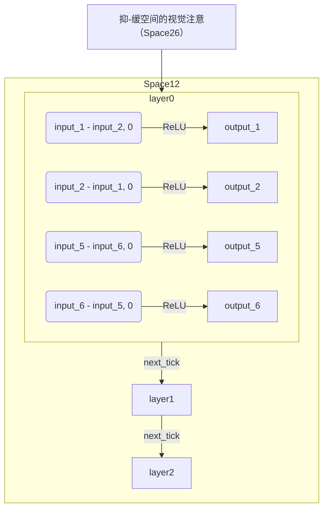
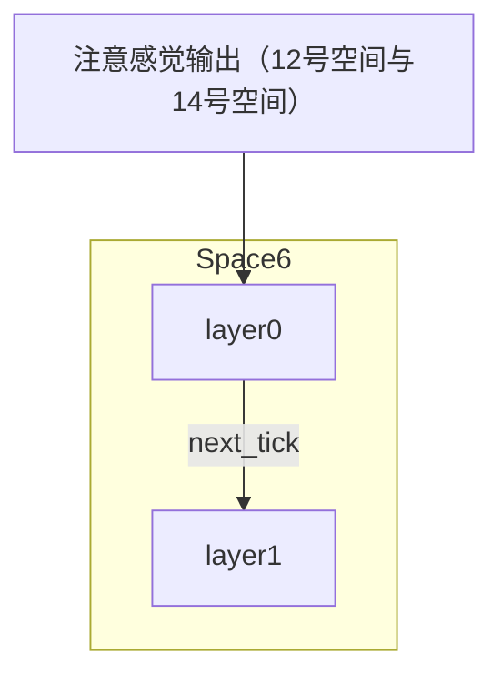
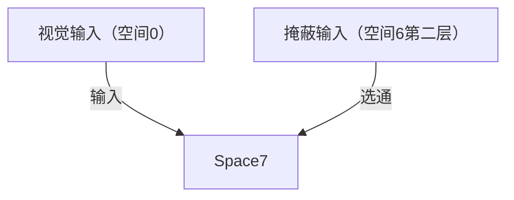
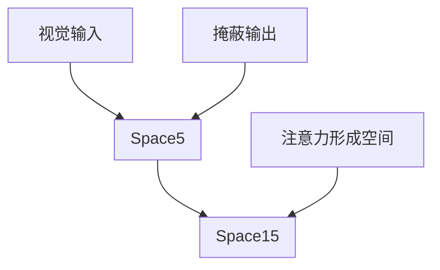

# 仿生脉冲神经网络——*揭开生物智慧之谜*

以下内容转述自 [spikingnn](htps://www.spikingnn.net) 的原始文档。

## 概述

本模型模拟了一个简单的智能体系，它有一个视觉输入和一个听觉输入，有一个眼动输出和一个语音输出。经过训练，可以完成以下两类任务：

1. 通过眼动跟踪并识别在三维空间做随机以及漂浮运动的字母（注：漂浮运动是指字母沿自身 xyz 轴做小角度来回旋转运动）
2. 在三维空间中随机呈现的两三个不同字母中，找出并识别与听觉输入相匹配的字母

### 视觉输入

本模型有一个由 21x21 个神经元组成的视网膜，通过小孔成像方式感知外部世界；神经元在视网膜上的分布是非线性的——类似于人眼，即：在中心区域分布密度高，边缘分布密度低。

因此，视网膜中心图像较为清晰时，分辨率较高；边缘图像较为模糊，分辨率较低。也就是说，在观察对象偏离视网膜中心时，便很难分辨。

### 听觉输入

本模型有一个由 17x17 个神经元组成的简易听觉输入层，该神经元层被分为八个区域，不同区域的兴奋组合象征着不同的声音模式：

- a: `[0, 2]`
- o: `[1, 2]`
- e: `[0, 3]`
- i: `[1, 3]`
- u: `[0, 4]`
- ü: `[1, 4]`
- b: `[2, 4]`
- p: `[3, 4]`
- m: `[0, 5]`
- f: `[1, 5]`
- d: `[2, 5]`
- t: `[3, 5]`

### 序列编码

本模型通过 `toPulse()` 函数，将感觉神经元兴奋强度变化转换成对应的脉冲序列，当神经元兴奋强度增加时，对应的脉冲序列脉冲密度升高，反之，脉冲密度下降；而整个系统便是由来自视觉输入和听觉输入的各个神经元的脉冲序列所驱动。

以下是伪代码（原始的代码为 C++ 版本，可读性有一些难度，顾尝试重新实现）：

```python
def to_pulse(space, perception):
    for i in space.length:
        neuron = space[i]

        ...
        # TODO implement func
        # strength to frq
        # add a counter to inc

        if perception[i] > threshold:
            pass
        else:
            pass
```

### 网络

本模型中有一个由17个网络空间组成的仿生脉冲神经网络(如下图所示)，每个网络空间由1-3层神经元层组成，每个神经元层由289-576个神经元组成。


| 空间 ID | 空间名 | 层数 | 神经元 |
|:------:|:------|:----:|:------:|
| 空间 0 | 视觉输入空间 | 3 | 21*21 |
| 空间 1 | 听觉输入空间 | 3 | 17*17 |
| 空间 5 | 语音空间 | 2 | 17*17 |
| 空间 6 | 注意力形成空间 | 2 | (20\*20, 19\*19) |
| 空间 7 | 掩蔽空间 | 1 | 21*21 |
| 空间 8 | 注意力形成空间 | 2 | (20\*20, 19\*19) |
| 空间 11 | 眼动空间 | 2 | (20\*20, 19\*19) |
| 空间 12 | 注意感觉输入空间 | 3 | 17*17 |
| 空间 14 | 注意感觉输入空间 | 3 | 17*17 |
| 空间 15 | 语音空间 | 1 | 19*19 |
| 空间 24 | 抑制形成空间 | 1 | 17*17 |
| 空间 26 | 抑-缓（抑制-缓解抑制）空间 | 1 | 24*24 |
| 空间 27 | 眼动输出空间 | 1 | 17*17 |
| 空间 28 | 语音输出空间 | 1 | 17*17 |
| 空间 31 | 抑缓（抑制缓解）形成空间 | 1 | 17*17 |
| 空间 33 | 眼动感觉输入空间 | 3 | 17*17 |
| 空间 34 | 注意力形成空间 | 1 | (20\*20, 19\*19) |


其中，空间0为**视觉输入空间**，空间1为**听觉输入空间**，空间27为**眼动输出空间**，空间28为**语音输出空间**，空间26为**抑-缓空间**。

### 眼动输出

空间 27 为眼动输出空间，它由 17x17 个神经元组成，并被随机地分为八组。

| 组号 | 数目| 作用 |
|:----:|:---:|:---|
| 0 | 71~72 | 向左 |
| 1 | 71~72 | 向右 |
| 2 | 71~72 | 向上 |
| 3 | 71~72 | 向下 |
| 4~7 | 1 | reserved |

其中眼睛转动的速度取决于两侧兴奋程度的差值，当二者相等时则眼睛保持静止不动。

### 语音输出

空间 28 为语音输出空间，它由 17x17 个神经元组成，并被随机地分为八组，系统的发音便是由这八组神经元控制。

可以这么理解：这八组神经元分别与控制声带的八组肌肉相连接，而这八组肌肉的不同收缩模式产生不同的发音。（该分组和听觉输入有差别）

### 抑-缓空间

抑-缓空间：顾名思义就是指产生抑-缓精神感受的空间（这里只是简单地类比，在其他人的一些模型中，它也常被称为评价系统）。

如前所述，空间 26 为抑-缓空间，它是由 24x24 个神经元组成，并被随机地分为八组。

其中， 0 组、 4 组神经元兴奋时产生抑制的缓解， 3 组、 7 组神经元兴奋时则产生抑制； 1-2 组、 5-6 组神经元被用于产生视觉注意，它们的兴奋水平决定了视觉注意中心的位置。偏离程度的大小与二者*差值*的大小成正比。

| 组号 | 数目| 作用 |
|:----:|:---:|:---|
| 0 | 72 | 抑制的缓解 |
| 1 | 72 | 向右的注意 |
| 2 | 72 | 向左的注意 |
| 3 | 72 | 抑制 |
| 4 | 72 | 抑制的缓解 |
| 5 | 72 | 向下的注意 |
| 6 | 72 | 向上的注意 |
| 7 | 72 | 抑制 |

## 神经元模型

如上所述，本模型中的仿生脉冲神经网络是由若干个网络空间组成，网络空间是由若干个神经元层组成，而神经元层则是由若干个整齐排列的神经元组成。因此，神经元便是仿生脉冲神经网络的最小组成单元。

本模型中的所有神经元都有抑制（`0`）、兴奋（`1`）两个状态，时间轴则采用离散的序列 $\{t_0,~t_1,~t_2,~t_3 \cdots t_n\}$ 表示；当某神经元在 $t$ 时刻处于兴奋状态时，它会向与它相连的所有神经元发送一个神经脉冲，并影响后者在 $t+1$ 时刻的状态；神经脉冲便是以这种方式在神经网络中传播。

本模型中的神经元大致可分为三类：

- 感觉传入神经元
- 掩蔽神经元
- 脉冲神经元

下面就分别对它们进行具体介绍：

### 感觉传入神经元

感觉传入神经元是指感觉传入空间所包含的神经元，空间0（视觉输入空间）、空间1（听觉输入空间）、空间12（注意感觉输入空间）、空间14（注意感觉输入空间）和空间33（眼动感觉输入空间）中的神经元都属于这一类神经元。

感觉传入神经元的功能非常简单：就是将神经脉冲一对一的向后传播；因此，后一神经元层在t时刻的兴奋状态就是前一神经元层在t-1时刻兴奋状态的拷贝。

### 掩蔽神经元

掩蔽神经元是指掩蔽空间（空间7）所包含的神经元，我们可以简单地把它看做是具有选通功能的感觉传入神经元。对于一个掩蔽神经元而言，只有当与其掩蔽连接相连的那组神经元的平均兴奋达到一定水平时，从与其相连的感觉传入空间神经元传入的神经脉冲才能使其发放。

### 脉冲神经元

除了掩蔽空间和上面谈到的感觉传入空间之外的**所有**网络空间中所包含的神经元都属于脉冲神经元。脉冲神经元是仿生脉冲神经网络中起主要作用的神经元，也是唯一具有学习能力的一类神经元。

脉冲神经元通过**正向连接**、**侧抑制连接**与其它神经元相连，接收来自其它神经元的神经脉冲。正向连接是指与同一神经元层以外的其它神经元层之间的连接，侧抑制连接则是指与同一神经元层中其它神经元的连接；侧抑制连接的强度大小是固定不变的，因此，侧抑制连接不具有塑造与学习能力；侧抑制连接的主要作用是产生神经元之间的同层竞争。

每个脉冲神经元都有一个**内部电位**，其变化如下所示：

| case | do |
|:-----|:---|
| 没有外部输入 | 电位会随时间逐渐衰减到零（实际应该为 RP ） |
| 神经脉冲沿连接传入 | 使内部电位产生一个正比于该连接强度大小的电位变化（当连接强度为正时，内部电位升高，连接强度为负时，内部电位下降） |
| 电位变化累积到一定程度而达到或超过阈值电位 | 神经元便会由抑制转为兴奋，同时发放一个神经脉冲 |
| 兴奋期后 | 内部电位超极化（进入不应期） |
| 不应期后 | 恢复正常 |

## 网络结构

### 视听觉

空间 0 为视觉输入空间，空间 1 为听觉输入空间；它们都由三个神经元层组成，后一神经元层在 $t$ 时刻的兴奋状态是前一神经元层在 $t-1$ 时刻兴奋状态的拷贝。它们的第一层（0层）神经元则产生模拟的视/听觉输入脉冲序列。



### 眼动感觉

空间 33 为眼动感觉输入空间，它由三个神经元层组成，每个神经元层由 17x17 个感觉传入神经元组成；后一神经元层在 $t$ 时刻的兴奋状态是前一神经元层在 $t-1$ 时刻兴奋状态的拷贝。它的第一层（0层）神经元则产生模拟的眼动感觉输入脉冲序列。



具体地讲，它的第一层（0层）神经元被随机地分为八组，每组中神经元的平均兴奋水平都是相同的，其大小与空间 27 的眼动输出相对应：当空间 27 中 `0` 组与 `1` 组的神经元平均兴奋水平的差值为正时，空间 33 对应的 `0` 组神经元兴奋，其兴奋水平等于上述差值，反之，`1` 组神经元兴奋，其兴奋水平等于上述差值的负值；类似地，当空间 27 中 `2` 组与 `3` 组的神经元平均兴奋水平的差值为正时，空间 33 对应的 `2` 组神经元兴奋，其兴奋水平等于上述差值，反之，`3` 组神经元兴奋，其兴奋水平等于上述差值的负值。

```python
neg_map = {
    'left': 'right',
    'right': 'left',
    'up': 'down',
    'down': 'up'
}

def calc_perception(
    average_active_map: Dict[str, Any]
) -> Dict[str, Any]:
    perception = {}
    for group in average_active_map:
        perception[group] = max(
            average_active_map[group] - average_active_map[neg_map[group]],
            0
        )
    
    return perception
```

### 注意感觉输入

#### 注意感觉输入（均匀正比）

空间 12 为注意感觉输入空间，它由三个神经元层组成，每个神经元层由 17x17 个感觉传入神经元组成；后一神经元层在 $t$ 时刻的兴奋状态是前一神经元层在 $t-1$ 时刻兴奋状态的拷贝。它的第一层（0层）神经元则产生模拟的注意感觉输入脉冲序列。

空间 12 与空间 33 非常类似，它们之间的差别在于：空间 12 对应的是来自空间 26 的 1-2 组、 5-6 组神经元产生的视觉注意输出。



#### 注意感觉输入（强度滑杆）

空间 14 也是注意感觉输入空间，它由三个神经元层组成，每个神经元层由 17x17 个感觉传入神经元组成；后一神经元层在 $t$ 时刻的兴奋状态是前一神经元层在 $t-1$ 时刻兴奋状态的拷贝。它的第一层（0层）神经元则产生模拟的注意感觉输入脉冲序列。

空间 14 与空间 12 非常类似，只是它的第一层（0层）神经元产生注意感觉输入脉冲序列的方式与空间 12 有所不同。具体地讲，空间 14 的第一层（0层）的各组神经元是采用「强度滑杆」的方式来产生注意感觉输入的。

> **强度滑杆**：设想一组神经元顺序地排列成一行 $(0, 1, 2, \dots , n)$，当感觉输入强度很低时，神经元 0-2 等强度兴奋，其它神经元抑制；当感觉输入强度有所增加时，神经元 1-3 等强度兴奋，其它神经元抑制；当感觉输入强度再增加时，神经元 2-4 等强度兴奋，其它神经元抑制；…… 依此类推。也就是说，感觉输入强度与兴奋神经元位置正相关；不同的神经元兴奋代表不同的感觉输入强度。
>
> 需要注意的是：空间 33 和空间 12 产生模拟感觉输入的方式可被称为「均匀正比」方式。

```python
strength_value = {
    'weak': 0.2,
    'middle': 0.5,
    'strong': 0.7,
    'paralyze': 1.2
}

def strength_map(input_value):
    if input_value <= strength_value['weak']:
        return [1, 2]
    elif input_value <= strength_value['middle']:
        return [3, 4]
    ...
```

### 注意区域形成空间

空间 6 为注意区域形成空间，它由两个神经元层组成，第一层（0层）由 19x19 个神经元组成，第二层（1层）由 21x21 个神经元组成。空间 6 接收来自空间 12 和空间 14 的神经脉冲，并在其第二层（1层）形成与注意区域相似的兴奋区域。



### 掩蔽空间

空间 7 为掩蔽空间，它由一个 21x21 的神经元层组成。空间 7 接收来自空间 0 的一对一视觉传入，其神经元的掩蔽连接与空间 6 的第二层（1层）神经元相连。

我们可以将空间 7 简单地看做是具有选通功能的视觉传入空间，也就是说，只有与空间 6 的第二层（1层）的兴奋区域相对应的区域的视觉输入可以被传入，而其它区域的视觉输入将被屏蔽。



### 语音空间

空间 5 、空间 15 都是语音空间。空间 5 由两个神经元层组成，分别包含20x20、 19x19 个神经元；空间 5 接收来自空间 7 和空间 0 的神经脉冲。空间 15 由一个 19x19 的神经元层组成，接收来自空间 5 和空间 8 的神经脉冲。



空间 28 前文已有介绍，它接收来自空间 15 和空间 26 的神经脉冲。

### 眼动空间

空间 11 为眼动空间。空间 11 由两个神经元层组成，分别包含 20x20 、 19x19 个神经元；空间 11 接收来自空间 0 和空间 7 的神经脉冲。

空间 27 前文已有介绍，它接收来自空间 11 、空间 24 和空间 8 的神经脉冲。

### 注意形成空间

空间 8 、空间 34 为注意形成空间。空间 8 由两个神经元层组成，分别包含 20x20 、 19x19 个神经元；空间 8 接收来自空间 0 和空间 7 的神经脉冲。

空间 34 由一个 17x17 的神经元层组成，接收来自空间 33 和空间 8 的神经脉冲。

### 抑-缓

空间 24 为抑制形成空间，由一个 17x17 的神经元层组成，接收来自空间 5 和空间 1 的神经脉冲。

空间 31 为抑缓形成空间，由一个 17x17 的神经元层组成，接收来自空间 5 和空间 1 的神经脉冲。

空间 26 前文已有介绍，它接收来自空间 34 、空间 24 和空间 31 的神经脉冲。

> *注：抑缓是抑制的缓解的简称。*

### 连接组

见下图：


### 抑-缓调控：

本模型中采用的抑-缓调控为空间传入抑-缓调控，被调控的空间有空间8、空间11、空间26、空间27和空间28。

具体地讲：对于空间8、空间11而言，当系统抑制时，其来自空间7的神经传入比例增加(相对于来自空间0的神经传入)，当系统抑缓时，其来自空间7的神经传入比例减少；对于空间26而言，当系统抑缓时，其来自空间31的神经传入比例增加(相对于来自空间34、空间24的神经传入)，当系统抑制时，其来自空间31的神经传入比例减少；对于空间27而言，当系统抑制时，其来自空间11和空间8的神经传入比例增加(相对于来自空间24的神经传入)，当系统抑缓时，其来自空间11和空间8的神经传入比例减少；对于空间28而言，当系统抑制时，其来自空间26的神经传入比例增加、来自空间15的神经传入比例减少，当系统抑缓时，其来自空间26的神经传入比例减少、来自空间15的神经传入比例增加。

## 演示程序介绍

略。

本模型共经历了两个训练阶段，第一个阶段为有导师训练阶段（类似于大人手把手地教小孩写字），训练它识别在三维空间中做随机运动的 12 个字母；第二个阶段为无导师训练阶段（类似于马戏团训练小动物：当其行为正确时给予奖励、错误时给予惩罚），训练它在两三个字母中找出并识别与背景声音相匹配的字母。第一个训练阶段结束时的连接状态被保存在 `Step1` 子目录下，第二个训练阶段结束时的连接状态被保存在 `Step2` 子目录下。

---

# 认知过程中的恒常性

在人们对外部世界的认知过程中，恒常性是一种非常重要而普遍的性质。当一个熟悉的物体进入我们的视野中，无论它是在左边还是在右边、是远是近、是静止还是运动，我们都会将它知觉为同一个物体，这便是认知过程中的恒常性。通过下面这个演示模型，我们可以很好地理解这一现象的本质。

## 系统概述

本模型由空间0、空间5、空间28 三个网络空间组成。

空间0为视觉输入空间，它有一个由31x31个神经元组成的视网膜，通过小孔成像方式感知外部世界，神经元在视网膜上的分布是线性的。空间0共有三个神经元层，后一神经元层在t时刻的兴奋状态是前一神经元层在t-1时刻兴奋状态的拷贝。

空间5由四个神经元层组成，分别包含31x31、27x27、23x23、19x19个神经元；空间5接收来自空间0的神经脉冲。

空间28为语音输出空间，它由一个15x15的神经元层组成，并被随机地分为八组(如下图所示)，系统的发音便是由这八组神经元控制。当1组神经元兴奋时，系统会发‘a’音，当0组神经元兴奋时，系统会发‘o’音，当3组神经元兴奋时，系统会发‘e’音，当2组神经元兴奋时，系统则会发‘i’音……

---

# 仿生脉冲神经网络理论中的四个基本概念

仿生脉冲神经网络理论中有四个重要的基本概念，它们是：输入散解性、输出集约性、传播塑造、抑-缓调控，以下就对它们分别进行具体介绍。

## 输入散解性

输入散解性是指外部信息在传入仿生脉冲神经网络前会被散解成若干小的单元。以视觉输入为例，当一个视觉图像被投射到一个有 100x100 个感光神经元的视网膜上时，它便被散解成 10000 个像素点；在这一过程中信息会有遗失（如果图像被投射到有 1000x1000 个感光神经元的视网膜上，信息遗失就会减少）。另一方面，对于某个感光神经元而言，它会将像素点随时间的亮度变化转换成一个神经脉冲序列，亮度越高脉冲密度越大，亮度越低脉冲密度越小；如果用最小脉冲周期分割这一脉冲序列，便可得到一个由数字 `0` 、 `1` 组成的序列，也就是说，像素点随时间的亮度变化信息被散解成了数字 `0` 、 `1` 序列；在这一过程中信息也会有所遗失（最小脉冲周期越小，信息遗失越少）。

对于前一种散解，我们称之为空间散解，而后一种散解则被称为时间散解。通过空间散解与时间散解，任何感觉信息，无论是视觉、听觉、嗅觉、触觉还是鲨鱼对生物电场的感知，最终都可以被转换成若干个数字 `0` 、 `1` 序列；这也就是说，仿生脉冲神经网络可以用完全相同的方式处理各种不同的感觉信息，这是仿生脉冲神经网络的一个重要特性。

值得注意的是，空间散解性是为人们所熟知的，而时间散解性则通常被传统神经网络理论所忽视，这也是仿生脉冲神经网络理论与传统神经网络理论的主要差别之一。

## 输出集约性

输出集约性是与输入散解性相反的概念。对生物体而言，神经网络的最终输出都表现为运动，尽管运动可以是整体性的或者是难以察觉的，但所有的运动都依赖于生物体某部位某一肌肉群的收缩；而控制肌肉收缩的，往往不是一个或几个神经元，而是一组神经元；更准确地说，控制肌肉收缩的是这一组神经元的平均兴奋水平，这便是输出的集约性。与输入散解性相对应，输出集约性也可分为时间集约性和空间集约性。时间集约性是指单个神经元在某一时间间隔内的平均兴奋水平，此时单个神经脉冲并无实际意义，有意义的是神经元在某一时间间隔内的平均脉冲发放密度；空间集约性则是指控制肌肉收缩的一组神经元的平均兴奋水平，此时单个神经元的作用是微小的，一组神经元的共同作用才是决定性的。从另一个角度讲，肌肉的收缩力度与单位时间达到该肌肉组织的神经脉冲总数正相关。

## 传播塑造

传播塑造从微观上讲是指，当神经脉冲经由突触(连接)从一个神经元传递到另一个神经元时，该突触(连接)的性质(强度)将会因此而发生改变；从宏观上讲是指，当外部信息流进入并在神经网络中传播时，神经网络的性质(状态)会因此而发生改变。事实上，这种传播塑造现象对于我们来说是很熟悉的－－无论我们留意与否，对于刚经历过的事，我们都会有所记忆，这就是传播塑造的结果。

因此，传播与塑造是紧密相关、同时发生的，就像河水在河床里流动一样，一方面河床限制了河水的流动方向，另一方面河水又在不断地冲刷着河床，缓慢地改变着河道的走向。所以，可以这样讲：传播塑造产生记忆，记忆的积累形成经验，而经验的积累孕育出智慧；换言之，智慧源于记忆、源于传播塑造！

## 抑-缓调控

**抑-缓**：是“抑制与抑制的缓解”的简称。对生物体而言，抑制是指饥饿、干渴、疲惫……等抑制性生理状态；抑制的缓解则是指与之相反的生理状态，如：饥饿时饱餐一顿、干渴时痛饮一杯、疲惫时睡一大觉……  另一方面，本文中的抑-缓则是特指上述生理状态下的精神感受(一种比较抽象的精神感受)。

**抑-缓调控**：顾名思义就是指抑-缓精神感受所产生的神经调控。抑-缓调控通常都是一些整体性的、较高层次的神经调控，它所针对的不是一个或几个神经元，而是整个神经元层乃至网络空间(例如：从一个网络空间到另一网络空间传输性质的调控、对某个网络空间塑造性质的调控等等)。

抑-缓调控是生物神经网络自发展的基础。
